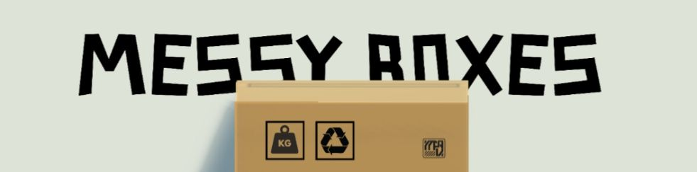
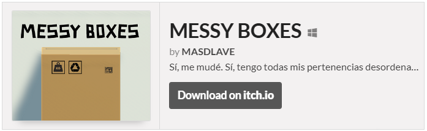

# MESSY BOXES

Proyecto de juego desarrollado con Unity 3D para familiarizarme con el motor y sus herramientas. Una práctica inicial para aprender los fundamentos del desarrollo de videojuegos.

## Assets - Unity 3D 2022.3.62
En este repositorio encontrarás la carpeta de _Assets_ propia del motor de **Unity3D**. El prpyeecto fue trabajado sobre la versión [2022.3.62](https://unity.com/es/releases/editor/whats-new/2022.3.62) en dos semanas (aproximadamente). Todos los elementos utilizados están catalogados en la [tienda](https://assetstore.unity.com/listing#nf-ec_price_filter=0...0) correspondiente descritos como gratuito o _free_.

### Link de descarga

